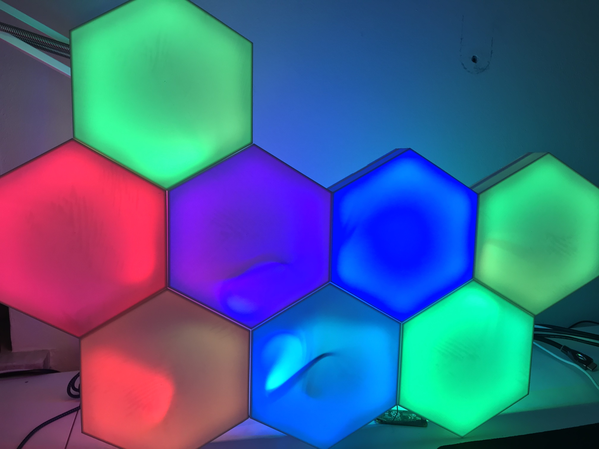

# WS2812 LED Strip Animations

A **very** basic app to control WS2812 LED strips with a raspberry pi.

This consists of a Node app which serves a simple HTML page to manage the strip and includes libraries to control the strip.

You can use it for WS2812 (NeoPixel) christmas lights, or other simple DIY applications. I used it for a couple applications, including Christmas Tree Lights and an artistic decorative dodecahedron.

Its also possible to integrate your LED-Strip to Homebridge. With that you can control the Strip via Apple Home App



# Current Animations

1.  Static Color
	 - Set A Static Color and adjust the brightness
2.  Rainbow
     - Cycle through all colors and pulse through strip.
3.  Fade 2 Colors
     - Choose 2 colors and fade the strip between them.
4. Dance
   -  Each LED is rapidly moving through the color wheel, giving a 'disco' / 'dance' effect.
5.  Starry Night
    -  Twinkling, white LED effects to simulate stars! :star:
6.  Christmas Tree
     - Randomly cycle R / G / B / W through the strip.
7. Christmas Iterate
     - Iterate a segment of R / G / B / W LEDs through the strip from top to bottom and bottom to top

# Important Reading

I found this NPM package : https://www.npmjs.com/package/rpi-ws281x-native
Read this page.

It led me to follow the instructions here at Adafruit: https://learn.adafruit.com/neopixels-on-raspberry-pi.

I used a WS2812 and just connected it to a Raspberry Pi Zero W GPIO 18 and it worked.

# Hardware

- WS2812 (Neopixel) LED Light Strip or LEDs
- Raspberry Pi 3 Model B, Raspberry Pi Zero, or Raspberry Pi Model B (other Raspberry Pis should work fine but are untested)
- 5V Power Supply

```Note 
- At 5V , each LED from WS2812b draws about 50mA when set to its full brightness. For 30 LEDs its 1.5A

- I also powered my Raspberry Pi over the 5V Power Supply and it works fine.
```

# Connections

1.  Connect DATA IN of your WS2812 LED strip to physical pin 12 of the Raspberry Pi. (GPIO 18).
2.  Connect GND (Physical pin 6) to the GND lead of your power supply.
    - Refer to this image for a layout of the raspi pins: https://www.element14.com/community/servlet/JiveServlet/previewBody/73950-102-11-339300/pi3_gpio.png

Optional if you want to power your Rapsberry Pi also via the Powersupply: 
3. Connect a Cable from the Power Supply V+ to the physical pin 2 of the Raspberry Pi. 
3. Connect a Cable from the Power Supply V- to a ground pin of the Raspberry Pi. 

# Devices

Tested working on:
  1) Raspberry Pi 3 Model B
  2) Raspberry Pi Zero W (some slowness can occur)
     -  Pinout. I connected PSU ground to PIN6 (GND) and DATA to the LED strip on PIN12 (GPIO18)
     -  
     -  **Important** make sure that the power supply's ground is connected to a ground connection on the Pi.
  3) Raspberry Pi Model B (some slowness can occur)

# Raspberry Pi Setup

1.  Install NodeJS
    -  [This NodeJS on Raspi tutorial was super helpful for me](https://desertbot.io/blog/nodejs-git-and-pm2-headless-raspberry-pi-install)
2.  Copy this repo to some location on your pi
    -  Easy option: use git
       -  `sudo apt install git`
       -  `git clone https://github.com/luxdvie/WS2812Controller.git`
 3.  During node setup, I ran into some permissions issues with the `rpi-ws281x-native` package on my pi zero. [I performed these steps](https://stackoverflow.com/questions/52979927/npm-warn-checkpermissions-missing-write-access-to-usr-local-lib-node-modules):
       -  add following lines to `~/.bashrc` after installing npm:
			```
			npm set prefix ~/.npm
			PATH="$HOME/.npm/bin:$PATH"
			PATH="./node_modules/.bin:$PATH"
			Execute following line after changes:
			```
			then run:
			`source ~/.bashrc`
4.  Globally install the node-gyp package 
    -  `npm i -g node-gyp`
5.  Run `npm install` in the root of this project to install all dependencies
    -  **Important troubleshooting note** If you run into issues during installation, you may want to try deleting the `package-lock.json` and `node_modules` directory, and trying `npm install` again. Avoid using `sudo` for npm install if you can!
6.  Modify NUM_LEDS in `strip.js` to match the number of LEDs you have connected
	```
	var NUM_LEDS = <YOUR_LEDS_HERE>;
	```
7.  Modify HTTP_PORT in app.js to match the port you want to use to access your Pi.
	```
	var HTTP_PORT = <YOUR_PORT_HERE>;
	```
8.  Run app.js as root user or with sudo privileges.
	```
    node /path/to/me/app.js
	```
9.  Access app.html to control the LED strip from the IP Address of your raspi.
	```
    http://<YOUR_IP_ADDRESS_HERE>:<YOUR_PORT_HERE>/
	```

# Running on Pi Startup
Create a new File `/etc/systemd/system/<service>.service` replace <service> with your own service’s name) with the following content.

```
[Unit]
Description=WS2812b Controller with Homebride functionality
After=network.target
[Service]
User=root
WorkingDirectory=<path to your app>
ExecStart=<app start command f.g. node app.js>
Restart=always
[Install]
WantedBy=multi-user.target
```

Then, reload systemd, enable the service and finally, start it.

`$ sudo systemctl daemon-reload`

`$ sudo systemctl enable <service>`

`$ sudo systemctl start <service>`

# Homebridge / Homekit integration

It is possible to control the Strip with the Apple Home App over Homebridge. 
At first go to your Homebridge and install [homebridge-better-http-rgb](https://www.npmjs.com/package/homebridge-better-http-rgb)

After installing this go to the Plugin Settings an configure your Strip.

Example:

```json 
{
    "accessory": "HTTP-RGB",
    "name": "LED Strip",
    "service": "Light",
    "switch": {
        "status": "http://<your_raspberrypi_ip>:8080/api/v1/status",
        "powerOn": "http://<your_raspberrypi_ip>:8080/api/v1/on",
        "powerOff": "http://<your_raspberrypi_ip>:8080/api/v1/off"
    },
    "color": {
        "status": "http://<your_raspberrypi_ip>:8080/api/v1/color",
        "url": "http://<your_raspberrypi_ip>:8080/api/v1/color/%s"
    },
    "brightness": {
        "status": "http://<your_raspberrypi_ip>:8080/api/v1/brightness",
        "url": "http://<your_raspberrypi_ip>:8080/api/v1/brightness/%s"
    }
}
```


# Security Note

**Disclaimer** The `rpi-ws281x-native` package requires root access, so you have to run the `app.js` with `sudo` or as `root`... Do this at your own risk :) I never expose my Pi to the internet, so I'm not as concerned about this, but definitely I would not recommend you ever expose this service to the internet, especially when configured this way!

# Author

Original Author: 
Austin Brown [GitHub](https://github.com/luxdvie),  [austinbrown2500@gmail.com](mailto:austinbrown2500@gmail.com)

Author for AddOns (Homebridge, etc): 
Dominic Rösch [GitHub](https://github.com/domi256), [256domi@googlemail.com](mailto:256domi@googlemail.com)


# Legal Stuff

Although already forbidden by the sources and subsequent licensing, it is not allowed to use or distribute this software for a commercial purpose.


HomeKit Accessory Protocol (HAP) is Apple’s proprietary protocol that enables third-party accessories in the home (e.g., lights, thermostats and door locks) and Apple products to communicate with each other. HAP supports two transports, IP and Bluetooth LE. The information provided in the HomeKit Accessory Protocol Specification (Non-Commercial Version) describes how to implement HAP in an accessory that you create for non-commercial use and that will not be distributed or sold.
The HomeKit Accessory Protocol Specification (Non-Commercial Version) can be downloaded from the HomeKit Apple Developer page.
Copyright © 2020 Apple Inc. All rights reserved.